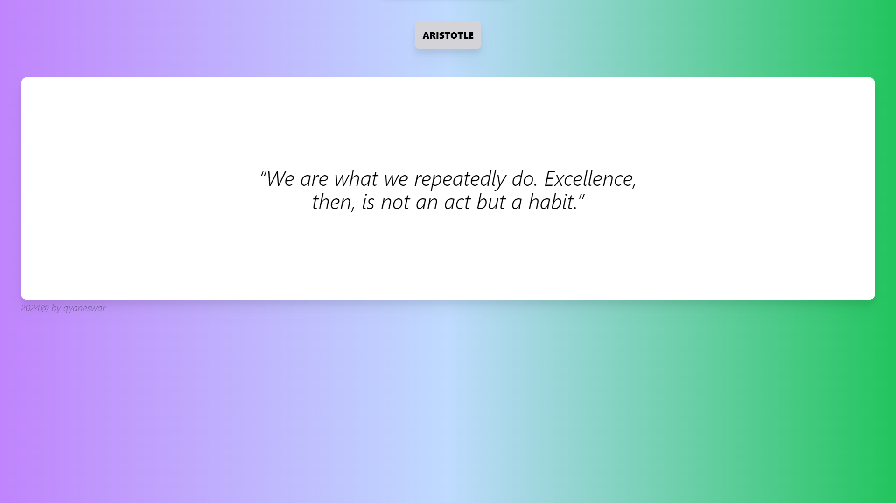

# Random Quote 🗿
## _API Project_


power by express and Axios,
also responsive for mobile devices




- axios 🌲
- ✨ beautiful ui✨ 


## Tech

- [Axios] - api call for web apps!
- [vs code] - awesome text editor
- [css] - great UI boilerplate for modern web apps
- [node.js] - evented I/O for the backend.

## Installation

Dillinger requires [Node.js](https://nodejs.org/) v10+ to run.

Install the dependencies and devDependencies and start the server.

```sh
cd server
npm i
nodemon index.js
cd ..
cd client
npm i
npm run dev
o + enter
```

> open local port

# Important
postgreSQL should be installed on your device 
and make sure to create a table that should match the table name in the 
server and change the password 

**Free Software, Hell Yeah!**


